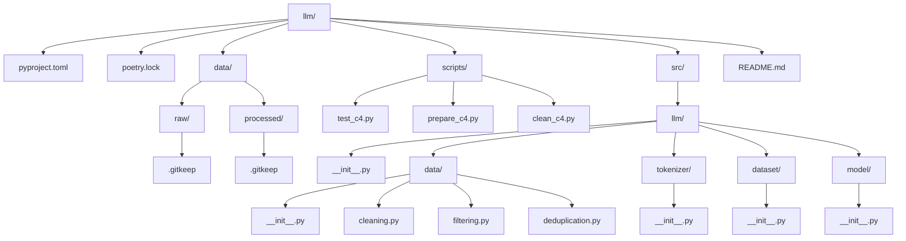

# Structure du projet

Voici la structure de base du projet:

```mermaid
flowchart TD
    ROOT["llm/"]

    ROOT --> CONFIG["pyproject.toml"]
    ROOT --> LOCK["poetry.lock"]

    ROOT --> DATA["data/"]
    DATA --> RAW["raw/"]
    RAW --> RAW_KEEP[".gitkeep"]
    DATA --> PROCESSED["processed/"]
    PROCESSED --> PROCESSED_KEEP[".gitkeep"]

    ROOT --> SCRIPTS["scripts/"]
    SCRIPTS --> TEST["test_c4.py"]
    SCRIPTS --> PREPARE["prepare_c4.py"]
    SCRIPTS --> CLEAN["clean_c4.py"]

    ROOT --> SRC["src/"]
    SRC --> LLM["llm/"]

    LLM --> INIT["__init__.py"]

    LLM --> LLM_DATA["data/"]
    LLM_DATA --> DATA_INIT["__init__.py"]
    LLM_DATA --> CLEANING["cleaning.py"]
    LLM_DATA --> FILTERING["filtering.py"]
    LLM_DATA --> DEDUP["deduplication.py"]

    LLM --> TOKENIZER["tokenizer/"]
    TOKENIZER --> TOKENIZER_INIT["__init__.py"]

    LLM --> DATASET["dataset/"]
    DATASET --> DATASET_INIT["__init__.py"]

    LLM --> MODEL["model/"]
    MODEL --> MODEL_INIT["__init__.py"]

    ROOT --> README["README.md"]
```
Pour en voir plus sur le projet, je vous invite à aller dans /documentation/pipeline_projet.txt