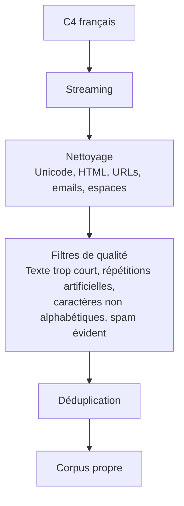

Etape 1 - 2 - 3 du pipeline_project.txt

Récupération de donnée via C4 de hugging face

----------------------------------------------------------------
1-nettoyage:

# C4 français

## Pipeline de préparation

a-installation des dépendances:
poetry add datasets transformers torch tqdm

b-récupération d'une partie du dataset avec scripts/test_C4.py pour le teste

c-récupération de 1000 document avec scripts/prepare_C4.py

d-nettoie le HTML, les URLs, les emails, les espaces et on élimine les documents manifestement mauvais sans supprimer trop de contenu utile avec le scripts/clean_C4.py

d-vérifation du corpus après le nettoyage avec scripts/inspect_clean_C4.py

e-le dataset brut est conservé dans data/raw/c4_clean.jsonl

f-le dataset nettoyé est conservé dans data/processed/c4_clean.jsonl

d-à noter que 913 documents ont été nettoyés, et ce seront eux qui seront utilisés

